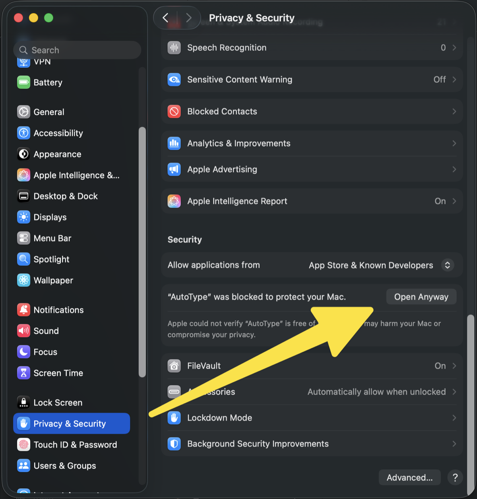

# AutoType

**Giữ một phím tắt → ký tự tuôn ra liên tục vào ô bạn đang gõ. Thả tay → dừng ngay.**

App macOS nhỏ, dùng để test font, đổ text lấp chỗ trong Figma, stress-test ô nhập liệu, sinh dữ liệu rác có kiểm soát.

---

# Cài đặt — chọn 1 trong 2 cách

| | Cách 1 · Dán một dòng | Cách 2 · Không cần Terminal |
|---|---|---|
| Phải mở Terminal | Có (chỉ dán, không cần biết gì) | **Không** |
| Cảnh báo bảo mật của macOS | **Không có** | Có — phải bấm "Vẫn mở" một lần |
| Thời gian | ~30 giây | ~2 phút |
| Máy cần đáp ứng thêm | Không | Phải bấm được nút **Vẫn mở** — [xem yêu cầu](#yêu-cầu-để-bấm-được-nút-vẫn-mở) |

Khác nhau vì `curl` không gắn cờ kiểm dịch lên file, còn trình duyệt thì có — nên file tải bằng trình duyệt luôn bị macOS chặn ở lần mở đầu.

---

## Cách 1 · Dán một dòng

Mở **Terminal** (bấm ⌘ + Space, gõ `Terminal`, Enter), dán dòng này rồi Enter:

```bash
curl -fsSL https://raw.githubusercontent.com/wblekhoa/autotype/main/install.sh | bash
```

Xong. Nhảy xuống [Bước cuối](#bước-cuối--bật-quyền-trợ-năng).

---

## Cách 2 · Không cần Terminal

### 1. Tải app

Bấm **[⬇︎ Tải AutoType.zip](https://github.com/wblekhoa/autotype/releases/latest/download/AutoType.zip)** (~1 MB).

### 2. Giải nén và kéo vào Applications

Mở file ZIP vừa tải → được **AutoType**. Kéo nó vào thư mục **Applications**.

### 3. Lần đầu mở — macOS sẽ chặn, đây là bình thường

Bấm đúp AutoType. macOS hiện thông báo đại ý *"Apple không kiểm tra được app này có mã độc hay không"*.

**Đây không phải app bị lỗi.** App chưa mua chứng chỉ Apple Developer (99 USD/năm) nên macOS chặn mặc định mọi app kiểu này.

Làm theo đúng thứ tự:

1. Bấm **Done** (hoặc **Cancel**). **Đừng bấm Move to Trash.**
2. Mở **Cài đặt hệ thống** → **Quyền riêng tư & Bảo mật**.
3. Kéo xuống mục **Bảo mật**, tìm dòng báo `AutoType` bị chặn.
4. Bấm **Vẫn mở** (Open Anyway).
5. Xác nhận bằng Touch ID hoặc mật khẩu máy.
6. Cảnh báo hiện lại lần nữa → bấm **Mở** (Open).

Bước 3 và 4 trông đúng như hình dưới — dòng báo nằm trong mục **Security**, nút **Open Anyway** ở mép phải cùng hàng:



Nút này dành cho **app bị chặn gần nhất**. Không thấy dòng nào nhắc tới AutoType → bấm đúp AutoType thêm một lần rồi quay lại đây.

### Yêu cầu để bấm được nút Vẫn mở

**Không phải "mở khoá" Gatekeeper.** Đây là chỗ hầu hết mọi người hiểu nhầm. Bấm *Vẫn mở* tạo ngoại lệ cho **đúng một app**; Gatekeeper vẫn bật nguyên và mọi app khác vẫn bị soi như cũ. Bạn **không** cần tắt Gatekeeper, **không** cần `sudo spctl --master-disable`, **không** cần bật lựa chọn "Anywhere" đã bị Apple giấu đi, và **không** cần `sudo` ở bất kỳ bước nào.

Cũng **không cần đổi ô *Allow applications from***. AutoType ký kiểu ad-hoc (`TeamIdentifier` trống) nên nó trượt **cả hai** lựa chọn của ô đó — để *App Store* hay *App Store & Known Developers* thì kết quả vẫn y hệt, và *Vẫn mở* là đường vòng riêng nằm ngoài ô đó.

Thứ bạn thực sự cần chỉ có 3 điều:

| Cần | Vì sao | Không đạt thì |
|---|---|---|
| Bạn là **quản trị viên máy**, hoặc có mật khẩu quản trị | Bước 5 đòi Touch ID hoặc mật khẩu máy — chỉ cho riêng lần bấm đó | Nhờ người quản trị bấm hộ |
| Mục **Bảo mật** không bị **MDM** khoá | Máy do công ty/trường cấp có thể bị khoá — mục hiện mờ, hoặc kèm dòng báo đang được quản lý | Hỏi bộ phận IT, hoặc dùng [Cách 1](#cách-1--dán-một-dòng) |
| Vừa bấm đúp AutoType **ngay trước đó** | Nút chỉ hiện cho app bị chặn gần nhất | Bấm đúp AutoType lần nữa rồi mở lại Cài đặt |

Từ **macOS 15 trở đi, mẹo cũ "Control-click → Open" không còn tác dụng** — bắt buộc đi qua Cài đặt hệ thống như trên.

Vướng một trong ba điều trên thì dùng [Cách 1](#cách-1--dán-một-dòng): `curl` không gắn cờ kiểm dịch lên file nên macOS không chặn, và cả mục này trở thành không liên quan.


Thao tác này chỉ tạo ngoại lệ cho **đúng một app**, không tắt Gatekeeper toàn máy. Apple mô tả cùng quy trình tại [Open a Mac app from an unknown developer](https://support.apple.com/guide/mac-help/mh40616/mac).

Lỡ bấm **Move to Trash**? Khôi phục từ Thùng rác, hoặc tải lại rồi làm lại.

---

## Bước cuối — bật quyền Trợ năng

**Cả hai cách đều cần bước này.** macOS không cho bất kỳ app nào tự cấp cho mình quyền gõ phím — đây là rào bảo mật thật, không lách được và cũng không nên lách.

Mở AutoType → nó chỉ thẳng chỗ cần bật. Hoặc tự vào:

> **Cài đặt hệ thống → Quyền riêng tư & Bảo mật → Trợ năng** → bật **AutoType**

Bật xong dùng được ngay, **không cần mở lại app**.

### Thử luôn

Mở **TextEdit**, click vào vùng soạn thảo, **giữ ⌃⌘T** vài giây. Ký tự sẽ tuôn ra. **Esc** để dừng.

---

## Hai chỗ hay vướng nhất

**Bấm phím tắt mà không thấy gì?** Kiểm tra bạn có đang đứng ở **cửa sổ AutoType** không. App cố ý không tự gõ vào ô của chính nó — hãy chuyển sang app bạn muốn gõ (TextEdit, Chrome, Figma…) rồi mới bấm. App sẽ báo bằng chữ cam kèm tiếng bíp khi gặp trường hợp này.

**Đã bật công tắc Trợ năng mà app vẫn báo đỏ?** Tắt rồi bật lại công tắc đó. Nếu vẫn vậy: chọn AutoType trong danh sách, bấm nút `−` để xoá, rồi mở lại app.

---

## Yêu cầu

| | |
|---|---|
| macOS | 13 trở lên |
| Máy | Intel hoặc Apple Silicon |
| Dung lượng | ~1 MB |
| Công cụ lập trình | **Không cần** (cả hai cách) |

Không cần API key, không cần Homebrew, không dùng `sudo`, không sửa shell profile.

## Cập nhật · Gỡ cài đặt

Cập nhật: chạy lại lệnh ở Cách 1, hoặc tải lại ZIP và kéo đè.

Gỡ:

```bash
rm -rf ~/Applications/AutoType.app && defaults delete com.lekhoa.autotype
```

Rồi bỏ AutoType khỏi danh sách Trợ năng.

> **Chỉ nên có ĐÚNG MỘT AutoType trên máy.** Mở nhầm bản ở đường dẫn khác thì macOS coi là app khác và bắt cấp quyền lại từ đầu. Kiểm tra: `mdfind -name AutoType | grep '\.app$'`

---

# Dùng

Mở app một lần, chỉnh cho vừa ý, rồi để đó. Từ giờ chỉ cần phím tắt.

## Cửa sổ và thanh menu

App có **biểu tượng bàn phím trên thanh menu** — bấm vào đó để mở lại cửa sổ, bật/tắt nhanh phím tắt, hoặc thoát hẳn.

**Đóng cửa sổ không tắt app.** Phím tắt vẫn chạy tiếp — đóng chỉ để dọn màn hình. Muốn tắt hẳn thì dùng **Thoát AutoType** trên thanh menu.

Cửa sổ kéo giãn được, nội dung tự cuộn nếu màn hình bạn thấp.

## Công tắc BẬT / TẮT (trên cùng)

Công tắc chủ. **Tắt** = phím tắt ngừng hoạt động hoàn toàn, bàn phím trả lại nguyên vẹn cho bạn — cứ để app mở mà không sợ lỡ tay. Đang gõ dở mà tắt thì dừng luôn.

## Hai cách kích hoạt

| Chế độ | Hành vi |
|---|---|
| **Giữ phím tắt thì gõ** *(mặc định)* | Giữ phím tắt → ký tự chảy liên tục. Thả → dừng |
| **Bấm một phát rồi chạy** | Bấm → gõ đúng số lượt đã đặt (hoặc vô hạn). Bấm lại để dừng |

Phím tắt mặc định **⌃⌘T**, đổi được trong app.

**Esc dừng khẩn cấp bất cứ lúc nào**, kể cả đang ở chế độ vô hạn.

## Ký tự sẽ gõ

| Lựa chọn | Nội dung |
|---|---|
| Chỉ chữ cái | `A-Z a-z` |
| Chỉ số | `0-9` |
| Chữ và số | `0-9 A-Z a-z` |
| **Toàn bàn phím** *(mặc định)* | 94 ký tự `!` → `~` |
| Văn bản tự nhập | Bạn gõ gì thì nó gõ nấy |

**Gõ ngẫu nhiên** (mặc định): mỗi ký tự bốc ngẫu nhiên từ bộ trên — hợp để lấp chỗ, test độ rộng.
**Bỏ chọn**: gõ đúng thứ tự, hết bộ quay lại đầu — hợp để test font, soi ký tự thiếu glyph.

## Số lượng và tốc độ

- **Số lượt** — chỉ áp dụng cho chế độ *bấm một phát*.
- **Vô hạn** — gõ tới khi bấm Esc, và **tự dừng sau 60 giây** như phanh thứ hai. Esc là phanh chính, nhưng một số app có thể nuốt phím Esc nên cần đường dừng dự phòng.
- **Tốc độ** — ký tự mỗi giây, tối đa 2000.

> **Đo được:** ở **200 ký tự/giây trở xuống**, ký tự tới nơi **chính xác từng cái một**. Từ khoảng 1000 trở lên, app nhận bắt đầu bỏ sót lẻ tẻ — ~0,7% ở mức 2000. Đây là giới hạn của bên nhận, không phải lỗi engine. Cần chuẩn từng ký tự thì để ≤200; cần đổ thật nhanh và không quan trọng vài ký tự thì đẩy lên cao.

---

## Lưu ý

**Không dùng ⌥ trong phím tắt.** Option là phím sinh ký tự trên macOS: `⌥T` ra `†`, `⌥⇧T` ra `ˇ`. Giữ phím tắt có ⌥ là macOS chèn rác vào ô trước khi app kịp gõ. App đã chặn không cho chọn ⌥ — dùng ⌃ ⇧ ⌘.

**Bộ gõ tiếng Việt không ảnh hưởng.** App gõ theo Unicode trực tiếp nên Telex/EVKey không xen vào được.

**Cẩn thận với chế độ vô hạn.** Nó bơm ký tự vào bất kỳ cửa sổ nào đang được chọn. Nhắm đúng ô trước, và nhớ Esc.

## Khi không chạy

App ghi log, đọc là biết hỏng khâu nào:

```bash
cat ~/Library/Logs/AutoType.log
```

| Log cho thấy | Nghĩa là |
|---|---|
| Không có dòng `START` nào | Phím tắt không kích hoạt — công tắc đang TẮT, hoặc app khác chiếm mất tổ hợp đó |
| `LỆCH · phím tắt đã lưu = X · bạn đang giữ = Y` | Bạn bấm nhầm tổ hợp |
| `TỪ CHỐI · thiếu quyền Trợ năng` | Chưa bật quyền |
| `TỪ CHỐI · cửa sổ AutoType đang được chọn` | Chuyển sang app cần gõ trước |
| `START` + `secureInput = true` | App đích bật Secure Input (ô mật khẩu…), macOS chặn mọi phím giả lập |
| `START` + `đã gửi N ký tự` mà màn hình trống | App đích không nhận sự kiện Unicode — mở issue kèm tên app |

---

## Bấm đúp thay vì gõ lệnh

Trong [ZIP mã nguồn](https://github.com/wblekhoa/autotype/archive/refs/heads/main.zip) có sẵn **`Install AutoType.command`** — bấm đúp là chạy, không phải gõ gì.

Nó làm đúng những việc mà lệnh ở Cách 1 làm: **tải bản dựng sẵn** rồi đặt vào `~/Applications`; chỉ tự biên dịch nếu không tải được (lúc đó mới cần Xcode Command Line Tools).

Vì file này tải qua trình duyệt nên macOS chặn ở lần mở đầu, giống Cách 2 — làm theo [6 bước "Vẫn mở"](#3-lần-đầu-mở--macos-sẽ-chặn-đây-là-bình-thường) ở trên.

Nếu bạn mở được Terminal thì Cách 1 nhanh hơn và không có cảnh báo nào.

## Tự biên dịch từ mã nguồn

Nếu bạn muốn tự build (hoặc đã sửa mã):

```bash
git clone https://github.com/wblekhoa/autotype.git && cd autotype && ./build.sh
```

Cách này cần **Xcode Command Line Tools** (`xcode-select --install`, ~2 GB). Không cần Xcode đầy đủ.

Ghi chú kỹ thuật + các bẫy nền tảng đã đo được: [docs/DEVELOPMENT.md](docs/DEVELOPMENT.md). Gate: `./verify.sh`.

---

## English

A tiny macOS utility that floods the focused text field with characters while you hold a global hotkey.

**Two ways to install — pick one:**

*Fastest, no security warning* (one line in Terminal):

```bash
curl -fsSL https://raw.githubusercontent.com/wblekhoa/autotype/main/install.sh | bash
```

*No Terminal at all*: download **[AutoType.zip](https://github.com/wblekhoa/autotype/releases/latest/download/AutoType.zip)**, unzip, drag to Applications. macOS will block it on first launch — that is expected for an app without a paid Apple Developer certificate. Go to *System Settings → Privacy & Security → Security*, click **Open Anyway**, confirm, then **Open**.

This does **not** disable Gatekeeper — it is a per-app exception, and no change to *Allow applications from* is needed. It does need admin rights and a Security pane not locked by MDM. If either is missing, use the one-line install above: `curl` sets no quarantine flag, so nothing is blocked.

Either way, finish by enabling **AutoType** under *System Settings → Privacy & Security → Accessibility* — macOS never lets an app grant itself keystroke permission.

Hold **⌃⌘T** in any text field to type, **Esc** to stop. macOS 13+, universal binary (Intel + Apple Silicon). MIT licensed.
---

## Giấy phép

MIT — xem [LICENSE](LICENSE).
